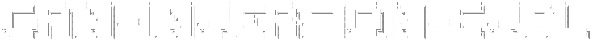
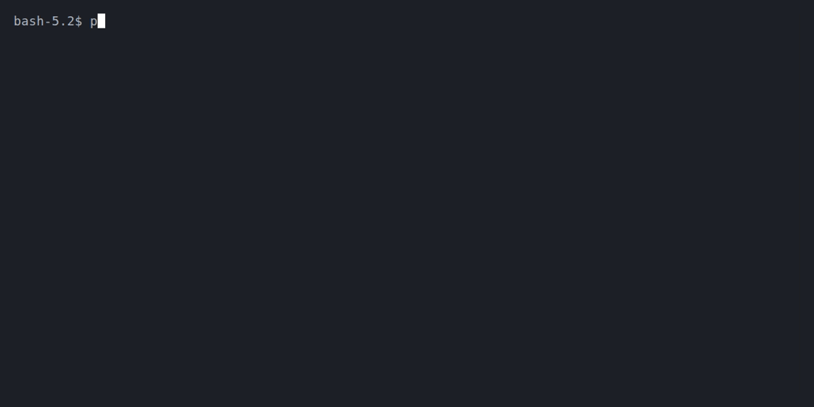

<br>

A benchmarking framework for evaluating GAN inversion methods that project real images into StyleGAN2's latent space. This project compares **two optimization-based approaches** ([Native Projector](https://github.com/NVlabs/stylegan2-ada-pytorch), [Image2StyleGAN](https://arxiv.org/abs/1904.03189)) and **one encoder-based approach** ([Encoder4Editing](https://arxiv.org/abs/2102.02766)), measuring reconstruction quality using MSE, SSIM, LPIPS, and facial identity similarity.

<p>
  <a href="#overview"></a>
  <a href="#prerequisites"></a>
  <a href="#project-structure"></a>
  <a href="#dataset"></a>
  <a href="#implementation-notes"></a>
  <a href="#installation"></a>
  <a href="#usage"></a>
  <a href="#results"></a>
  <a href="#acknowledgements"></a>
  <a href="#license"></a>
</p>


## Overview

GAN inversion is the task of finding a latent code that, when passed through a trained generator, reconstructs a given target image. This project implements and evaluates three approaches:

| Method | Type | Speed | Editability | Reconstruction |
|--------|------|-------|-------------|----------------|
| **Native Projector** | Optimization | Slow (~mins) | Medium | High |
| **Image2StyleGAN** | Optimization | Slow (~mins) | Medium | High |
| **Encoder4Editing (E4E)** | Encoder | Fast (~ms) | High | Medium |

### Pipeline

1. **Inversion** — Project target images into W+ latent space using each method
2. **Reconstruction** — Generate images from the inverted latent codes
3. **Evaluation** — Compare reconstructions using perceptual and identity metrics


## Prerequisites

* **Python** 3.6+ (3.8+ recommended)
* **PyTorch** 1.7+
* **CUDA** 11.0+ (for GPU acceleration)

**Tested on:** NVIDIA GPU with CUDA support


## Project Structure

```
GAN_Inversion/
├── assets/
│   └── demo.gif                    # Demo animation
├── datasets/
│   └── ffhq/
│       └── e4e_test_images/        # Test images for inversion
├── repos/
│   ├── encoder4editing/            # E4E encoder (cloned)
│   │   ├── checkpoints/
│   │   │   └── e4e_ffhq_encode.pt  # Pre-trained E4E weights
│   │   ├── scripts/
│   │   │   └── inference.py        # E4E inference script
│   │   └── environment/
│   │       └── e4e_env.yaml        # Conda environment
│   └── stylegan2-ada-pytorch/      # StyleGAN2-ADA (cloned)
│       ├── projector.py            # Native projector
│       └── checkpoints/            # StyleGAN2 weights
├── scripts/
│   ├── evaluation/
│   │   └── evaluate_inversion_args.py  # Evaluation metrics
│   └── image2stylegan/
│       ├── projector.py            # Image2StyleGAN implementation
│       └── loss.py                 # VGG perceptual loss
├── results/
│   ├── e4e_results/                # E4E outputs
│   ├── image2stylegan_results/     # Image2StyleGAN outputs
│   └── nativeprojector_results/    # Native projector outputs
└── README.md
```

## Dataset

This project uses the [FFHQ Dataset](https://github.com/NVlabs/ffhq-dataset) (Flickr-Faces-HQ):

- **70,000** high-quality PNG images
- **1024×1024** resolution (can be resized)
- Diverse coverage of age, gender, ethnicity, and accessories

Alternative source: [Kaggle FFHQ](https://www.kaggle.com/datasets/arnaud58/flickrfaceshq-dataset-ffhq)


## Implementation Notes

### Image2StyleGAN

My custom PyTorch implementation of [Image2StyleGAN](https://arxiv.org/abs/1904.03189) includes:

- **W+ optimization** in extended latent space
- **Perceptual loss** using VGG16 features (conv1_1, conv1_2, conv3_2, conv4_2)
- **Noise regularization** to prevent texture artifacts
- **Learning rate scheduling** with cosine rampdown

For a TensorFlow implementation, see [abhijitpal1247/Image2StyleGAN](https://github.com/abhijitpal1247/Image2StyleGAN).

### Encoder4Editing

Cloned from the [official repository](https://github.com/omertov/encoder4editing) by the paper authors.

### StyleGAN2-ADA

Cloned from [NVlabs/stylegan2-ada-pytorch](https://github.com/NVlabs/stylegan2-ada-pytorch). Uses NVIDIA's pre-trained FFHQ weights.


## Installation

1. **Clone the repository**
   ```bash
   git clone https://github.com/yourusername/GAN_Inversion.git
   cd GAN_Inversion
   ```

2. **Create the conda environment**
   ```bash
   conda env create -f repos/encoder4editing/environment/e4e_env.yaml
   ```

3. **Activate the environment**
   ```bash
   conda activate e4e_env
   ```

4. **Download pre-trained weights**

   | Model | Download | Destination |
   |-------|----------|-------------|
   | E4E FFHQ Encoder | [Google Drive](https://drive.google.com/file/d/1cUv_reLE6k3604or78EranS7XzuVMWeO/view) | `repos/encoder4editing/checkpoints/` |
   | StyleGAN2 FFHQ | Auto-downloaded | Via `--network` flag |

5. **Prepare test images**
   
   Place images to invert in:
   ```
   datasets/ffhq/e4e_test_images/
   ```


## Usage

### Image2StyleGAN Inversion (Custom Implementation)

```bash
python scripts/image2stylegan/projector.py \
    --network https://nvlabs-fi-cdn.nvidia.com/stylegan2-ada-pytorch/pretrained/ffhq.pkl \
    --target datasets/ffhq/e4e_test_images/00000.png \
    --outdir results/image2stylegan_results \
    --num-steps 1000 \
    --seed 42
```

### Native Projector (StyleGAN2-ADA)

```bash
cd repos/stylegan2-ada-pytorch
python projector.py \
    --network https://nvlabs-fi-cdn.nvidia.com/stylegan2-ada-pytorch/pretrained/ffhq.pkl \
    --target ../../datasets/ffhq/e4e_test_images/00000.png \
    --outdir ../../results/nativeprojector_results \
    --num-steps 1000
```

### Encoder4Editing (E4E)

```bash
cd repos/encoder4editing
python scripts/inference.py \
    --images_dir ../../datasets/ffhq/e4e_test_images \
    --save_dir ../../results/e4e_results \
    --checkpoint_path checkpoints/e4e_ffhq_encode.pt
```

### Evaluation

Compare all methods on a target image:

```bash
python scripts/evaluation/evaluate_inversion_args.py \
    --target datasets/ffhq/e4e_test_images/00000.png \
    --native results/nativeprojector_results/proj_1000.png \
    --e4e results/e4e_results/inversions/00001.jpg \
    --img2style results/image2stylegan_results/projected_img_1000steps.png
```

### Arguments Reference

| Argument | Type | Default | Description |
|----------|------|---------|-------------|
| `--target` | str | *required* | Path to the original target image |
| `--native` | str | *required* | Path to Native Projector reconstruction |
| `--e4e` | str | *required* | Path to E4E reconstruction |
| `--img2style` | str | *required* | Path to Image2StyleGAN reconstruction |


## Results



The evaluation script computes:

| Metric | Range | Better | Description |
|--------|-------|--------|-------------|
| **MSE** | [0, ∞) | Lower | Mean Squared Error (pixel-wise) |
| **SSIM** | [0, 1] | Higher | Structural Similarity Index |
| **LPIPS** | [0, 1] | Lower | Learned Perceptual Image Patch Similarity |
| **ID Similarity** | [-1, 1] | Higher | FaceNet cosine similarity (identity preservation) |


## Acknowledgements

- [NVlabs/stylegan2-ada-pytorch](https://github.com/NVlabs/stylegan2-ada-pytorch) — StyleGAN2-ADA implementation
- [omertov/encoder4editing](https://github.com/omertov/encoder4editing) — E4E encoder
- [Image2StyleGAN](https://arxiv.org/abs/1904.03189) — Original optimization-based inversion paper
- [FFHQ Dataset](https://github.com/NVlabs/ffhq-dataset) — High-quality face dataset


## License

This project is released under the MIT License. See individual repositories for their respective licenses.
